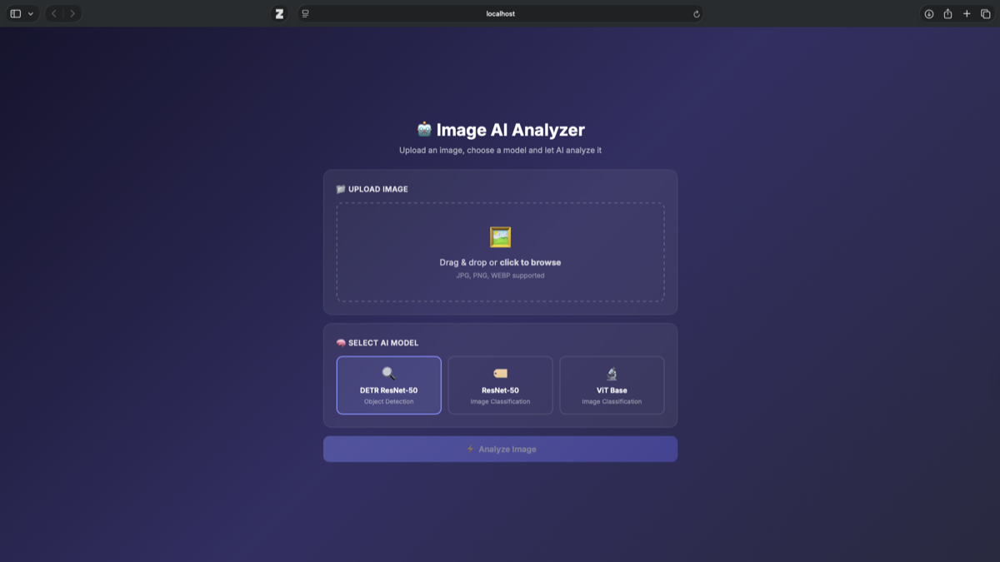
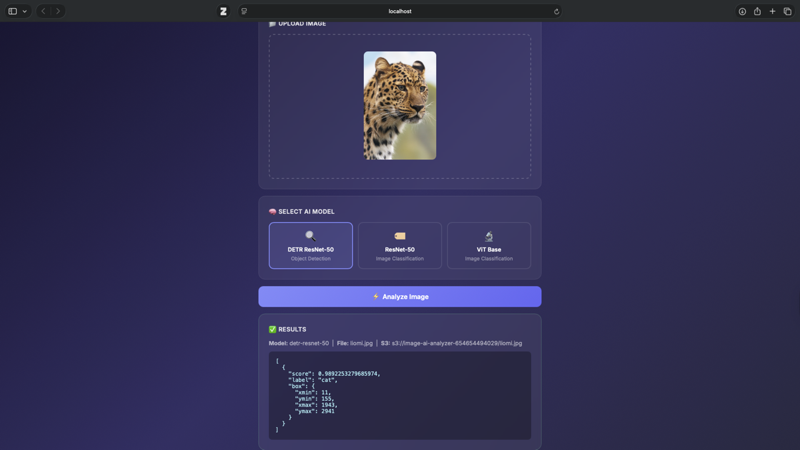
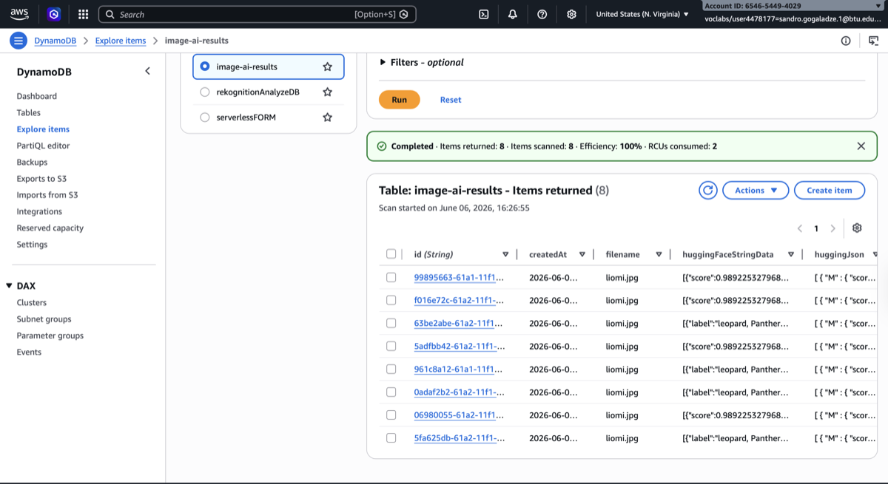
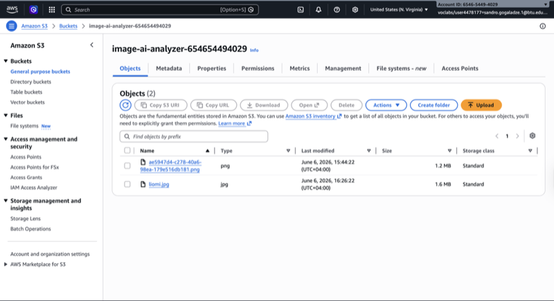

# 🤖 Image AI Analyzer

A serverless web application that analyzes images using HuggingFace AI models. Upload any image, choose a model, and get instant AI-powered analysis — all powered by AWS Lambda, API Gateway, S3, and DynamoDB.

---

## 📐 Architecture


```
Browser (HTML/CSS/JS)
    │
    │  POST /analyze (base64 image + model)
    ▼
Amazon API Gateway
    │
    ▼
AWS Lambda (Python)
    ├──► Amazon S3         (stores the image)
    ├──► HuggingFace API   (sends image for analysis)
    └──► Amazon DynamoDB   (stores the result)
```

---

## 🌟 Features

- 📁 **Drag & drop** or click-to-browse image upload
- 🧠 **3 AI Models** to choose from:
  - **DETR ResNet-50** — Object Detection (finds and locates objects)
  - **ResNet-50** — Image Classification (identifies what's in the image)
  - **ViT Base** — Image Classification (Google's Vision Transformer)
- ⚡ **Fully serverless** — no servers to manage
- 💾 Results saved to **DynamoDB**, images saved to **S3**
- 🔄 Real-time results displayed in the browser

---

## 🖥️ Demo

### Upload Form


### Analysis Result


### DynamoDB — Saved Results


### S3 — Saved Images


---

## 🗂️ Project Structure

```
image-ai-analyzer/
├── frontend/
│   ├── index.html          # Upload form UI
│   ├── style.css           # Styling
│   └── js/
│       └── app.js          # API calls & form logic
├── lambda/
│   └── handler.py          # Lambda function (HuggingFace + S3 + DynamoDB)
├── serverless.yml          # Infrastructure as code (one-command deploy)
├── configuration.json      # AWS resource names & region
└── .env                    # API tokens (not committed to Git)
```

---

## 🚀 How to Run

### Prerequisites
- AWS Account (with Academy Lab credentials)
- Node.js & npm
- Python 3.9+
- HuggingFace account & API token → [huggingface.co/settings/tokens](https://huggingface.co/settings/tokens)

### 1. Clone the repo
```bash
git clone https://github.com/YOUR_USERNAME/image-ai-analyzer.git
cd image-ai-analyzer
```

### 2. Set up environment variables
Create a `.env` file:
```
HF_API_TOKEN=your_huggingface_token
AWS_ACCESS_KEY_ID=your_key_id
AWS_SECRET_ACCESS_KEY=your_secret_key
AWS_SESSION_TOKEN=your_session_token
AWS_DEFAULT_REGION=us-east-1
```

### 3. Update `configuration.json`
```json
{
    "lambdaRole": "arn:aws:iam::YOUR_ACCOUNT_ID:role/LabRole",
    "region": "us-east-1",
    "dynamoDBtable": "image-ai-results",
    "s3Bucket": "image-ai-analyzer-YOUR_ACCOUNT_ID"
}
```

### 4. Deploy to AWS
```bash
npm install serverless@3
node_modules/.bin/serverless deploy
```

This single command creates:
- ✅ Lambda function
- ✅ API Gateway (POST /analyze)
- ✅ S3 Bucket
- ✅ DynamoDB Table

### 5. Run the frontend
```bash
cd frontend
python3 -m http.server 8080
```

Open [http://localhost:8080](http://localhost:8080)

---

## 🧠 How It Works

1. User selects an image and AI model in the browser
2. JavaScript converts the image to **base64** and sends it via `fetch()` to API Gateway
3. API Gateway triggers the **Lambda function**
4. Lambda:
   - Decodes the base64 image
   - Saves the image to **S3**
   - Sends the image bytes to **HuggingFace Inference API**
   - Saves the JSON result to **DynamoDB**
5. The result is returned to the browser and displayed

---

## 🤗 HuggingFace Models Used

| Model | Task | HuggingFace ID |
|-------|------|----------------|
| DETR ResNet-50 | Object Detection | `facebook/detr-resnet-50` |
| ResNet-50 | Image Classification | `microsoft/resnet-50` |
| ViT Base | Image Classification | `google/vit-base-patch16-224` |

---

## 🛠️ Tech Stack

| Layer | Technology |
|-------|-----------|
| Frontend | HTML, CSS, JavaScript |
| API | Amazon API Gateway |
| Compute | AWS Lambda (Python 3.9) |
| Storage | Amazon S3 |
| Database | Amazon DynamoDB |
| AI | HuggingFace Inference API |
| IaC | Serverless Framework v3 |

---

## ⚠️ Notes

- `.env` is in `.gitignore` — never commit API tokens
- AWS Academy session tokens expire — refresh credentials in `.env` when needed
- HuggingFace free tier models may have cold-start delays (~20s first request)
